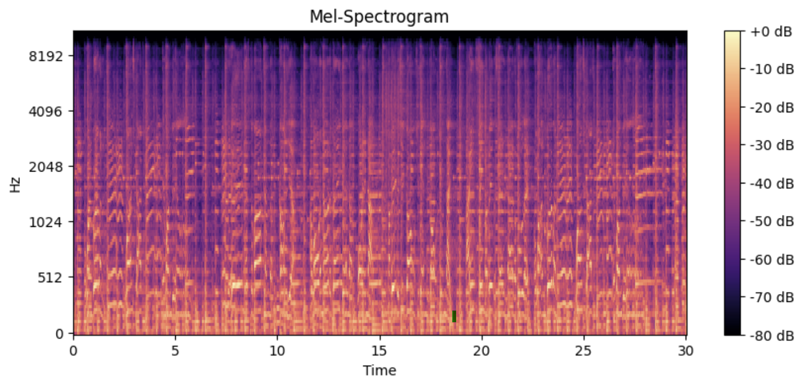

# 🎵 Music Genre Classification using CNN & Mel-Spectrograms 🎶

## Overview
This project classifies music into different genres using **Convolutional Neural Networks (CNNs)** and **Mel-Spectrograms**.  
The **GTZAN dataset** is used for training, and audio files are converted into spectrograms before feeding them into the model.

## 📌 Features
- Converts audio files into **Mel-Spectrograms** using `Librosa`
- Implements a **CNN model** for image classification of spectrograms
- Trains on the **GTZAN dataset** (10 music genres)
- Supports **GPU acceleration** for faster training
- Provides a **PyTorch Dataset loader** for easy training and evaluation

---

## 🛠️ Tech Stack
- **Python** (3.8+)
- **PyTorch**
- **Torchaudio**
- **Librosa** (Audio Processing)
- **Matplotlib** (Visualization)
- **Scikit-Learn** (Metrics)
- **NumPy & Pandas** (Data Handling)

---

## 🎵 Dataset: GTZAN
The **GTZAN dataset** contains:
- 10 genres: *blues, classical, country, disco, hiphop, jazz, metal, pop, reggae, rock*
- 1,000 audio tracks (30 sec each)
- Each genre has **100 audio samples**  

🔹 **Download GTZAN:** [Kaggle](https://www.kaggle.com/datasets/andradaolteanu/gtzan-dataset-music-genre-classification](https://www.kaggle.com/datasets/andradaolteanu/gtzan-dataset-music-genre-classification)

---
Example of Mel-Spectogram converted audio file:
